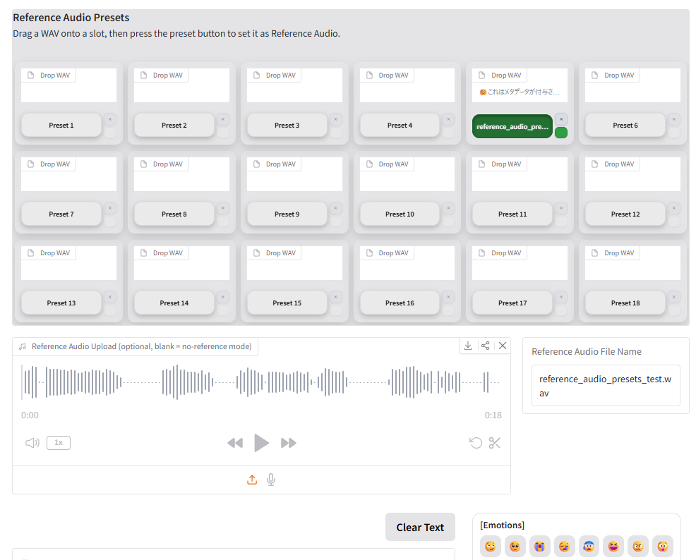
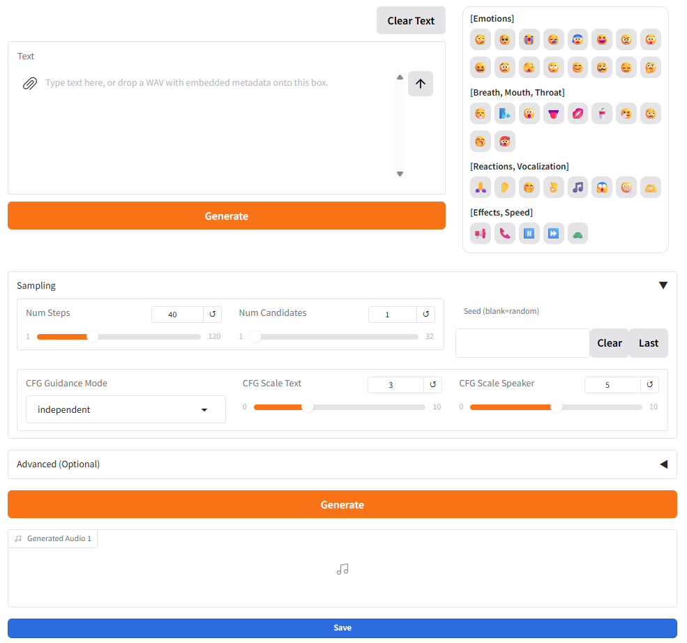

# Irodori-TTS Gradio UI Extended

このリポジトリは [Aratako/Irodori-TTS](https://github.com/Aratako/Irodori-TTS) を元にした fork / 改変版です。

主に、Irodori-TTS の Gradio 画面を使いやすくすることを目的にしています。  
参照音声を切り替えながら何度も生成する作業や、生成結果を比較して保存する作業をしやすくするために、参照音声プリセット、個別 Save ボタン、WAV メタデータによる設定復元などを追加しています。

## Screenshots

### Reference Audio Presets



### Generation UI



## 主な追加機能

### File Output Settings

生成 WAV ファイルの出力先フォルダと保存先フォルダを UI から設定できるようにしました。

作業用の出力先フォルダと、採用データの保存先フォルダを分けて管理できます。

### 生成結果の個別 Save ボタン

各 Generated Audio に個別の Save ボタンを追加しました。

生成された候補の中から、採用したい音声ファイルだけをワンクリックで保存先フォルダへコピーできます。

### Reference Audio Presets

参照音声をプリセットボタンへ登録し、ワンクリックで呼び出せるようにしました。

プリセットボタンは色を変更できます。  
また、ドラッグ操作で好きな位置へ並べ替えられます。

WAV ファイルに音声テキストのメタデータが埋め込まれている場合は、プリセット枠内にその内容の一部を表示します。

動作確認用のサンプルとして、`examples/reference_audio_presets_test.wav` を同梱しています。

### Reference Audio File Name

現在読み込まれている参照音声ファイル名を表示するようにしました。

どの参照音声が適用中か確認しやすくなります。

### 生成 WAV ファイル名の変更

生成した WAV ファイル名に、使用した参照音声ファイル名を反映するようにしました。

生成した WAV ファイルを見た時点で、どの参照音声を使ったものか判別しやすくなります。

### 生成音声ファイルへのメタデータ付与

生成した WAV ファイルに、生成時の設定をメタデータとして付与する機能を追加しました。

保存される主な情報は以下です。

- 音声テキスト
- Num Steps
- Num Candidates
- Seed
- CFG Guidance Mode
- CFG Scale Text
- CFG Scale Speaker

メタデータは通常のファイル操作では見えにくい情報ですが、後述の「生成時の設定復元」機能で使用します。

この機能を利用するには、Python ライブラリ [Mutagen](https://mutagen.readthedocs.io/) が必要です。

```bash
uv pip install mutagen
```

### Mutagen 依存について

メタデータ付与のために、音声ファイルのタグ読み書きを行うライブラリ Mutagen に依存しています。

Mutagen は Python 製のメタデータ操作ライブラリです。  
音声ファイルにタイトルや任意情報を書き込んだり、既存のタグを読み出したりする用途に使われます。

この fork では、生成した WAV ファイルに対して ID3 タグ形式で生成時の設定を書き込み、再読み込み時にその情報を取得します。

Mutagen が導入されていない場合、メタデータの保存・読み込み機能は使えません。  
ただし、音声生成自体とは別の補助機能なので、Mutagen がない場合でも音声生成そのものは動作します。

### 生成時の設定復元

メタデータ付き音声ファイルを Text 欄へドロップすると、埋め込まれた内容を読み取って、音声テキストや一部設定を復元できます。

また、プリセットボタンを Text 欄へドラッグ＆ドロップすることで、その参照音声ファイルに埋め込まれた内容を復元することもできます。

過去に生成した音声ファイルの条件を再利用したいときに便利です。

### Emoji / 記号パネル

感情表現や発声補助用の記号を、ボタンから入力できるようにしました。

### Clear Text

Text 欄の内容を空にする Clear Text ボタンを追加しました。

### Seed の Clear / Last

Seed 欄に Clear と Last を追加しました。

ランダム生成に戻す操作と、直前の Seed を再利用する操作をしやすくしました。

### Generate ボタンの追加

Generate ボタンをText 欄の下にも配置しました。

### Generate / Save ボタンの視認性改善

Generate ボタンおよび Save ボタンについて、押したことや処理中であることが分かりやすいように見た目を調整しました。

### 生成時のモデル取得の挙動

生成時にモデル取得関連で通信エラーがよく起こっていたため、
モデルを一度ダウンロードしたあとはローカルキャッシュを使用するようにしました。
ローカルキャッシュが存在する限り通信エラーは起こりません。

配布元のモデルが更新されても自動では反映されないため、最新版を使いたい場合はキャッシュを削除して再取得するか、ローカルのモデルファイルを手動で更新してください。
## 保存されるローカルファイルについて

この UI は、設定やプリセットをローカルファイルとして保存します。

主な保存先は以下です。

- `gradio_app_settings.json`
- `reference_audio_presets/`
- `output_voice/`

これらには、個人の設定、参照音声ファイル、生成した音声ファイルが含まれる可能性があります。  
GitHub へ公開する場合は、これらをコミットしないように注意してください。

`.gitignore` には、少なくとも以下を含めることをおすすめします。

```gitignore
gradio_app_settings.json
reference_audio_presets/
output_voice/
.gradio_visible_outputs/
__pycache__/
*.pyc
.venv/
venv/
```

## ライセンスと利用条件

この fork は [Aratako/Irodori-TTS](https://github.com/Aratako/Irodori-TTS) を元にした Gradio UI 改変版です。

コード、モデル重み、学習済みモデル、音声サンプルなどの利用条件は、元プロジェクトおよび各配布元のライセンスを確認してください。

この fork によって、元モデルや元プロジェクトのライセンス条件が変更されることはありません。

また、本人の同意なしに実在人物の声を模倣する用途、なりすまし、誤情報、権利侵害につながる用途には使用しないでください。

## Credits

この fork は [Aratako/Irodori-TTS](https://github.com/Aratako/Irodori-TTS) を元にしています。  
元プロジェクトの作者および関係者に感謝します。

この fork では、主に Gradio UI の操作性改善と、生成作業を繰り返し行うための補助機能を追加しています。

利用している主なライブラリ・ツール:

- [Irodori-TTS](https://github.com/Aratako/Irodori-TTS)
- [Gradio](https://www.gradio.app/)
- [Mutagen](https://mutagen.readthedocs.io/)


